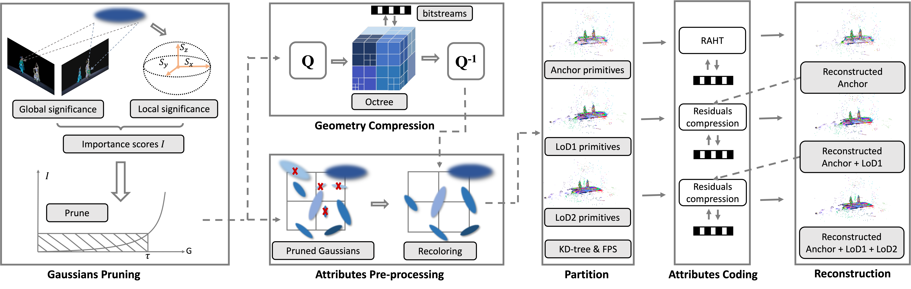

# [ICASSP'25] HGSC
Official Pytorch implementation of **A Hierarchical Compression Technique for 3D Gaussian Splatting Compression**.

<p align="center">
  
</p>

[[`Arxiv`](https://arxiv.org/abs/2411.06976)]  [[`Github`](https://github.com/H-Huang774/HGSC)]
## Installation
```
conda create -n hgsc python=3.8
conda activate hgsc
pip install torch==1.12.1+cu116 torchvision==0.13.1+cu116 torchaudio==0.12.1 --extra-index-url https://download.pytorch.org/whl/cu116

# Clone this repository
git clone https://github.com/H-Huang774/HGSC.git
cd HGSC

# Install submodules
pip install submodules/diff-gaussian-rasterization
pip install submodules/simple-knn

# Install other dependencies
pip install -r requirements.txt
```
## Dataset
Please organize the dataset with the trained pc.ply like below:
```
Results/
├── big_scenes/
│   ├──data_name (like Train)
│   │   ├── cameras.json
│   │   ├── point_cloud.ply
├── small_scenes/
│   ├──data_name
│   │   ├── cameras.json
│   │   ├── point_cloud.ply
big_scenes:
[[`Mip-nerf 360`] (https://jonbarron.info/mipnerf360)] 
[[`Deepblending`] (https://github.com/Phog/DeepBlending)] 
[[`Tanks and temples`] (https://www.tanksandtemples.org/download/)]
small_scenes:
[[`BungeeNeRF`] ((https://drive.google.com/file/d/1nBLcf9Jrr6sdxKa1Hbd47IArQQ_X8lww/view?usp=sharing)/[百度网盘[提取码:4whv]](https://pan.baidu.com/s/1AUYUJojhhICSKO2JrmOnCA))] 
[[`PKU-DyMVHumans`] (https://pku-dymvhumans.github.io)]
```
##Run
```
python run_big_scenes.py
python rrun_small_scenes.py
```
##Evaluation
```
python metric_scenes.py
```
## Citation
If you find our code or paper useful, please consider citing:
```
@INPROCEEDINGS{10887742,
  author={Huang, He and Huang, Wenjie and Yang, Qi and Xu, Yiling and Li, Zhu},
  booktitle={ICASSP 2025 - 2025 IEEE International Conference on Acoustics, Speech and Signal Processing (ICASSP)}, 
  title={A Hierarchical Compression Technique for 3D Gaussian Splatting Compression}, 
  year={2025},
  volume={},
  number={},
  pages={1-5},
  keywords={Visualization;Three-dimensional displays;Octrees;Termination of employment;Transforms;Signal processing;Rendering (computer graphics);Acoustics;Time complexity;Speech processing;3D Gaussian Splatting;Compression},
  doi={10.1109/ICASSP49660.2025.10887742}}
```
And thanks to the authors of [3DGS](https://repo-sam.inria.fr/fungraph/3d-gaussian-splatting/) for their excellent code!
